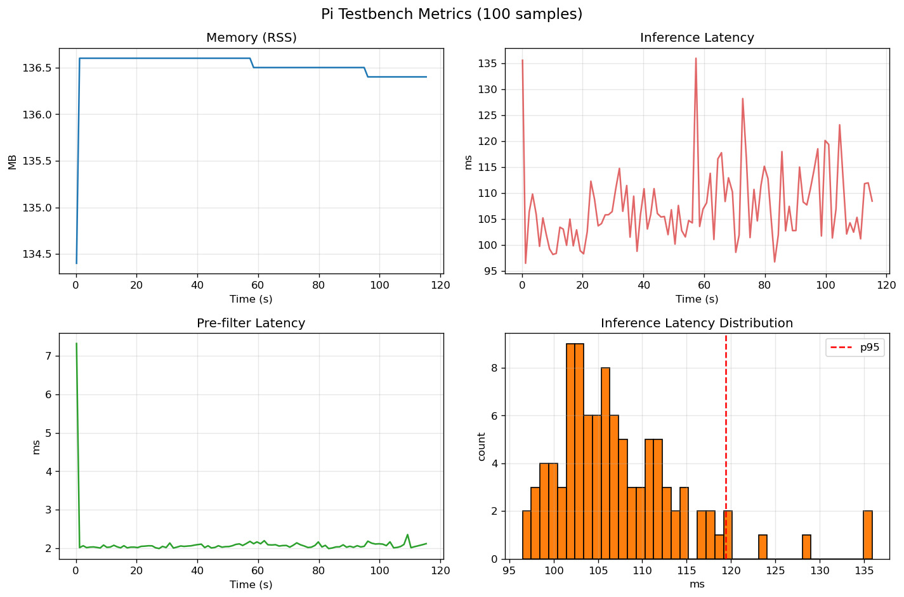

# Test\_01-Emulated\_Hardware\_Test\_generic

### 05.05.2026 

### Abgeschlossen

## 1 Zielsetzung und Motivation

* **Ziel:** Feststellung ob die Rechenkapazität und ein Arbeitsspeicher von 4GB eines Raspberry Pi 5 ausreichend ist, für lokale Inferenz der Lokalen Bildverarbeitung.
* **Motivation:** Vermeidung von Fehlkläufen der Companionboards bei unserem Budget, und Validierung der Hardware-Anforderungen vor der physischen Beschaffung.

## 2 Versuchsaufbau und Environment

###### 2.1 Hardware-Umgebung

* **Ausgeführt durch:&#x20;**&#x41;, Private Host Machine
* **Host-System:** Nobara Linux (Fedora based) auf einem Desktop PC (Ryzen 5600X, RTX 3070 8GB).
* **Laufzeit-/Testumgebung:** Docker Container mit ARM64(Pi CPU Architektur) 
  Emulation via QEMU

###### 2.2 Software-Stack & Ressourcen-Allokation

* **\<u>Gast-OS:\</u>** `dtcooper/raspberrypi-os:bookworm` - Offizielles Raspberry Pi OS als Docker image
  -> identische Paketquellen, identische Bibliotheksversionen wie ein echter Pi
* **Edge-ML-Framework:&#x20;&#xA;**`Python 3.11 mit TensorFlow Lite (TFLite)`
* ***Zur Erklärung:*****&#x20;**&#x54;FLite ist eine verschlankte Version des Machine-Learning-Frameworks TensorFlow, die speziell für "Edge Devices" (wie Smartphones oder unseren Raspberry Pi) entwickelt wurde.
* ***Zweck im Projekt:*** Es ist darauf optimiert, neuronale Netze mit minimalem Arbeitsspeicher- und CPU-Overhead auszuführen. Das Skript nutzt den `tflite.Interpreter`, um das Modell auf dem Pi 5 extrem ressourcenschonend zu starten und zu berechnen.
* **Ressourcen-Allokation:&#x20;**&#x33;,8GB RAM Limit (kein Swap), 4 CPU Cores (analog zum Pi 5).

## 3 Testkonfiguration und Parameter

###### 3.1 Sensorik und Eingabedaten

* **Eingabedaten:** Synthetisch generierte Single-Channel-Bilder. Spezifisch: Zufällig generierte Graustufen-Werte / Random Noise in uint16-Format, die das Ausgabeverhalten eines realen Wärmebildsensors simulieren.
* **\<u>Sensor-Auflösung (Array Size bzw. Rohdaten):\</u>** 640x512 Pixel (327682 Werte im Array).
  Entspricht gängigen Infrarot-Kameramodellen.

###### 3.2 Eingesetztes Modell (Stellvertreter / "Dummy-Payload"):

* **Spezifikationen:** MobileNetV2, INT8-quantisiert, ca. 3,4 MB Dateigröße.
* **Funktion & Begründung:** MobileNetV2 ist ein generisches Convolutional Neural Network (CNN) zur Bildklassifizierung (z. B. für Autos, Hunde, Toaster). Da wir das Modell in diesem Hardware-Test ausschließlich mit künstlichem Rauschen (White Noise) füttern, ist der \<u>inhaltliche\</u> Output völlig unbrauchbar.
* **Zielsetzung der Nutzung:** Dies ist beabsichtigt. Das Modell fungiert hier als digitale "Dummy-Payload". Da der Algorithmus fest verschaltet ist, muss er trotz des unbrauchbaren Rauschens denselben vollständigen Inferenz-Durchlauf (Millionen von Matrix-Multiplikationen) berechnen wie bei einem echten Infrarotbild. Dies simuliert exakt den realen CPU- und Speicher-Workload (RAM), den unser finales Brand-Erkennungs-Modell auf dem Boardcomputer erzeugen wird, ohne dass wir dieses bereits trainiert haben müssen.

###### 3.3 Test-Parameter

* **Modell-Auflösung (Downscale):&#x20;**&#x48;erunterskalierung der Eingabeframes auf \<u>224x224\</u> Pixel als Pre-Processing-Schritt für das neuronale Netz, da das als Stellvertreter genutzte MobileNetV2-Modell diese spezifische Eingangsdimension erfordert. 
  **`Anpassung auf Rohwerte erfolgt in Zukunft nach Einigung auf das benutze Kameramodell,
  und Trainierung eines eigenen Modells anhand der Kamera-Entscheidung. `**
* **Testumfang:** Sequenzielle Verarbeitung von \<u>1000 Frames.\</u>

## 4  Software-Pipeline und Methodik

###### 4.1 Datensynthese (Frame-Generierung):

* Erzeugung eines 640x512 Pixel großen Arrays mit zufälligen Werten im uint16-Wertebereich 
  (0 bis 65535).
* Dieses generierte "White Noise" repräsentiert kein reales Bild, simuliert aber exakt die Datenmenge und das Format, das von einer realen Thermalkamera an den Boardcomputer übergeben wird.

###### 4.2 Pre-Filtering (Schwellenwertprüfung):

* Ein Algorithmus summiert alle "Pixel" auf, die einen definierten Schwellenwert überschreiten.
  Im Testfall >5000. Hohe uint Werte -> "hellere" Pixel -> potentiel "heiße" Pixel
* Dieser Schritt dient als Gatekeeper: In der finalen Implementierung entscheidet dieser Filter auf voller Auflösung, ob sich die rechenintensive Ausführung des ML-Modells für den aktuellen Frame überhaupt lohnt.
* **Für unseren Stresstest haben wir prinzipiell jedes Bild weitergeleitet zum ML-Modell um die "****\<u>Worst-Case\</u>****" Auslastung zu testen.**

###### 4.3 Pre-Processing (Resizing & Channel-Mapping):

* **Resizing:** Der ursprüngliche Frame (640x512) wird mithilfe von OpenCV auf die Zielauflösung von 224x224 Pixel herunterskaliert, da das neuronale Netz (MobileNetV2, unser Stellvertreter) diese Dimensionen als Input erwartet.
* **Channel-Mapping:** Da MobileNetV2 für klassische RGB-Bilder trainiert wurde (3 Farbkanäle), unser Infrarot-Array aber nur Graustufen enthält (1 Kanal), wird das Array vor der Übergabe per Code dreifach repliziert. *(Dieser Workaround entfällt beim finalen, eigens trainierten Modell).*

###### 4.4 Inferenz-Ausführung (Performance-Messung):

* Das vorverarbeitete Array (White Noise) wird an den `tflite.Interpreter` übergeben.
* Das Modell führt nun alle mathematischen Operationen (Convolutions, Aktivierungsfunktionen) unter Volllast durch.
* Da der Input aus reinem Rauschen besteht, wird der inhaltliche Output des Algorithmus verworfen. Es geht ausschließlich darum, das System auszulasten, um die exakte \<u>Dauer der Berechnung (Inference Latency)\</u> und den \<u>Spitzen-Speicherbedarf (RAM)\</u> pro Frame zu messen.

###### 4.5 Architektur des Test-Skripts:

`Die in 4.1 bis 4.4 beschriebene Pipeline wird durch ein automatisiertes Python-Skript ausgeführt.`

* **Initialisierung:** Das Skript liest die übergebenen Container-Umgebungsvariablen (Auflösung, 1.000 Frames) ein und lädt das TFLite-Modell in den Arbeitsspeicher.
* **Ressourcen-Tracking:** Die Bibliothek `psutil` ist parallel an das Skript gekoppelt, um den realen RAM-Verbrauch (`Memory RSS`) des Prozesses in Megabyte zu überwachen.
* **Latenz-Messung:** Für jeden der 1.000 Frames werden exakte Zeitstempel (`time.perf_counter()`) vor und nach dem Pre-Filter sowie der Inferenz gesetzt, um die reine Berechnungsdauer präzise zu isolieren.
* **Logging:** Jeder 10. Frame wird aggregiert und mit seinen Werten in einer CSV-Datei (`inference_metrics.csv`) für die spätere Visualisierung und Auswertung (siehe Punkt 5) gespeichert.

## 5 Messergebnisse und Auswertung

`Die folgenden Auswertungen basieren auf dem vollständigen Durchlauf der 1.000 synthetischen Frames. Gemäß der Skript-Architektur wurde jeder zehnte Frame geloggt, woraus sich 100 hochauflösende Messpunkte für die Visualisierung ergeben.`

Aus den gemessenen Telemetriedaten lassen sich folgende Kernerkenntnisse ableiten:

###### 5.1 Speicherauslastung (Memory RSS):

* Die Speicherauslastung der gesamten Pipeline zeigt im Verlauf (Graph oben links) eine absolut flache Kurve. Nach dem initialen Laden des TFLite-Interpreters und der Tensor-Allokation pendelt sich der reale Arbeitsspeicherbedarf stabil bei einem Peak von **136,6 MB** ein
* **Auswertung:** Über den gesamten Testzeitraum konnte \<u>kein Memory Leak\</u> festgestellt werden. Bei dem simulierten Limit von 3,8 GB (entspricht dem nutzbaren Speicher des Pi 5 4GB) entspricht dies einer Auslastung von unter 4 %. Ein 4-GB-Board ist für diesen isolierten Use-Case massiv überdimensioniert und absolut ausreichend.

###### 5.2 Pre-Filter Latenz:

* Die Berechnung der potenziell heißen Pixel auf der vollen Sensorauflösung (640x512) benötigt nach einem kleinen Start-Spike im Durchschnitt extrem konstante **\~2 ms** pro Frame (Graph unten links).
* **Auswertung:** Dieser Gatekeeper-Schritt ist rechentechnisch fast vernachlässigbar ("quasi kostenlos"). Er qualifiziert sich hervorragend als Vorfilter für die finale Drohne, um wertvolle CPU-Ressourcen zu sparen.

###### 5.3 Inferenz-Latenz (Workload):

* Die Ausführung der Convolution-Operationen des MobileNetV2-Modells innerhalb der ARM-Emulation weist eine durchschnittliche Berechnungsdauer (Mean) von **\~107,35 ms** pro Frame auf. Der Median (P50) liegt bei 105,81 ms (Graph oben rechts).

###### 5.4 Latenz-Verteilung und Stabilität:

* Das Histogramm (Graph unten rechts) zeigt eine sehr kompakte Verteilung der Inferenzzeiten. Das 95. Perzentil (**P95**) liegt bei **119,38 ms**.
* **Auswertung***:* Das bedeutet, dass 95 % aller Frames unter Volllast in weniger als \~119,4 ms verarbeitet wurden. Es treten keine nennenswerten Ausreißer nach oben auf, was eine hohe System- und Thread-Stabilität während der Inferenz belegt.

###### 5.5 Rohdaten

* Der vollständige Export der Messwerte inklusive der CPU-Auslastungs-Prozente (`cpu_pct`) liegt diesem Dokument zur weiteren Nachvollziehbarkeit im Anhang als Datei bei.
  https://gist.github.com/Adisin2209/f8e33d52ddc9355d9dbe278db29f6173

## 6 Methodische Limitationen

* Die ermittelten Messwerte aus Abschnitt 5 repräsentieren einen "Dry-Run" unter simulierten Bedingungen. Für die finale Systemintegration auf der Drohne müssen folgende Limitationen des Versuchsaufbaus zwingend berücksichtigt werden:

###### 6.1 Emulations-Overhead & Latenz-Verzerrung

* Die genutzte Host-CPU (Ryzen 5600X) ist nativ deutlich leistungsstärker als der Broadcom-SoC des Raspberry Pi 5. Da der Docker-Container jedoch unter einer ARM64-Emulation läuft, muss QEMU jede ARM-Instruktion zur Laufzeit in eine x86-64-Instruktion des Hosts übersetzen. Dies erzeugt einen systembedingten Slowdown-Faktor von ca. 8-12x gegenüber nativer Ausführung. Dadurch wird die Host-CPU zwar künstlich in Richtung der Pi-Leistung gedrosselt, **die gemessenen Inferenz-Zeiten (\~107 ms) sind jedoch nicht 1:1 auf einen physischen Pi 5 übertragbar.** Reale Hardware dürfte nativ performanter agieren. Der belastbare Fokus dieses Tests lag primär auf der RAM-Auslastung.

###### 6.2 Fehlende I/O-Engpässe (Input/Output)

* Da die Bilddaten (White Noise) direkt im RAM des Containers generiert wurden, umgeht dieser Test den Datentransfer einer echten USB-Kamera. Mögliche I/O-Bottlenecks an den USB-Schnittstellen des Pi 5 sind hier nicht abgebildet.

###### 6.3 Thermische und energetische Blindspots

* **Stromverbrauch (Leistungsaufnahme):** Der reale Strombedarf (Watt) unter KI-Volllast kann nicht gemessen werden, ist aber essentiell für die Dimensionierung der Payload-Batterie (2 KG Limit-Constraint).
* **Thermal Throttling:** Es wurde nicht getestet, ob der Pi 5 unter Dauerlast zu heiß wird und sich heruntertaktet (was im Drohnen-Chassis ohne aktive Kühlung ein Risiko darstellt).

## 7 Fazit

Die primäre Zielsetzung des Tests wurde erfüllt: Die erfolgreiche Etablierung und Validierung einer messbaren Inferenz-Pipeline. Es konnte nachgewiesen werden, dass der komplette Inferenz-Loop unter Verwendung einer typischen Edge-CNN-Architektur (MobileNetV2 als Dummy-Payload) einen äußerst geringen Memory-Footprint (\~137 MB) aufweist.

Da die Architektur und Größe des finalen Brand-Erkennungs-Modells noch nicht feststehen, ist dieses Ergebnis als **starke, optimistische Indikation** zu werten. Sollte das finale Modell eine vergleichbare Komplexitätsklasse wie das Stellvertreter-Modell aufweisen, implizieren diese Daten, dass ein Raspberry Pi 5 mit 4 GB RAM für diesen spezifischen Anwendungsfall völlig ausreichend ist. Aus Speicher-Perspektive rechtfertigen diese Ergebnisse definitiv die Fokussierung auf die kostengünstigere 4-GB-Variante für alle weiteren physischen Tests, wodurch teurere Alternativen **vorerst** zurückgestellt werden können, und weitere Forschung an 4GB Modellen valide ist.

###### 7.1 Nächste Schritte

* **Physischer Hardware-Test:** Wiederholung des Benchmarks (`inference_bench.py`) auf nativer Raspberry Pi 5 Hardware zur Ermittlung realer Latenzzeiten.
* **Energie-Profilierung:** Messung des exakten Stromverbrauchs (via USB-Multimeter) während der Inferenz-Volllast auf der Zielhardware zur Kalkulation der Payload-Batterie.
* **Warten auf Evolonic und Sponsor Gespräche:** Klärung offener Parameter (insbes. Kameramodell), um das Resizing-Format festzulegen und die Limitierungen für die Größe und Komplexität des noch zu trainierenden, eigenen ML-Modells zu definieren.
